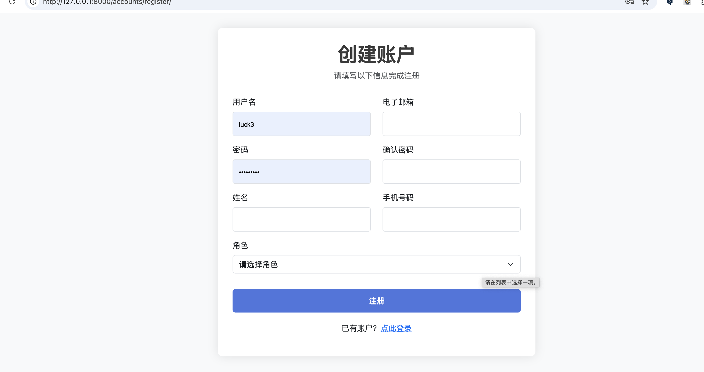

# 学生成绩管理系统

这是一个基于 Django 的学生成绩管理系统，支持教师、学生和管理员三种角色，提供成绩管理、课程管理、公告发布等功能。系统采用中文界面，适合中文用户使用。

## 技术栈

- **后端框架**: Django 4.x
- **前端框架**: 
  - Bootstrap 5.1.3
  - jQuery 3.6.0
  - Font Awesome 6.0.0
- **开发语言**: Python 3.8+
- **模板引擎**: Django Template

## 项目结构

```
DjangoProject/
├── accounts/                 # 用户账户相关应用
│   ├── models.py            # 用户模型定义
│   ├── views.py             # 视图函数
│   └── urls.py              # URL 配置
├── course/                  # 课程管理应用
│   ├── models.py            # 课程模型
│   └── views.py             # 课程相关视图
├── grades/                  # 成绩管理应用
│   ├── models.py            # 成绩模型
│   └── views.py             # 成绩相关视图
├── announcements/          # 公告管理应用
│   ├── models.py            # 公告模型
│   └── views.py             # 公告相关视图
├── templates/              # HTML 模板
│   ├── admin/              # 管理员模板
│   ├── teacher/            # 教师模板
│   └── student/            # 学生模板
├── static/                 # 静态文件
├── manage.py              # Django 管理脚本
└── requirements.txt       # 项目依赖
```

## 功能特性

1. **多角色支持**
   - 学生：查看成绩、查看公告
   - 教师：管理课程、录入成绩、查看公告
   - 管理员：系统管理、发布公告

2. **成绩管理**
   - 教师录入和修改成绩
   - 学生查看个人成绩
   - 支持多种成绩类型（期末考试、作业、测验等）

3. **课程管理**
   - 教师创建和管理课程
   - 学生查看已选课程

4. **公告系统**
   - 管理员发布和管理公告
   - 师生查看公告

## 部署说明

### 1. 环境要求
- Python 3.8 或更高版本
- pip 包管理器
- 虚拟环境工具 (推荐使用 virtualenv)

### 2. 安装步骤

1. **克隆项目**
```bash
git clone [项目地址]
cd DjangoProject
```

2. **创建并激活虚拟环境**
```bash
python -m venv venv
source venv/bin/activate  # Linux/Mac
# 或
venv\Scripts\activate  # Windows
```

3. **安装依赖**
```bash
pip install -r requirements.txt
```

4. **配置数据库**
```bash
python manage.py makemigrations
python manage.py migrate
```

5. **创建超级用户**
```bash
python manage.py createsuperuser
```

6. **收集静态文件**
```bash
python manage.py collectstatic
```

7. **启动开发服务器**
```bash
python manage.py runserver
```

### 3. 生产环境部署

1. **设置环境变量**
```bash
export DJANGO_SETTINGS_MODULE=DjangoProject.settings.production
export SECRET_KEY='your-secret-key'
export DEBUG=False
```

2. **配置数据库**
- 修改 settings.py 中的数据库配置
- 建议使用 PostgreSQL 作为生产环境数据库


1. **启动应用**
```bash
gunicorn DjangoProject.wsgi:application
```

## 开发指南

### 代码规范
- 遵循 PEP 8 Python 代码规范
- 使用 4 空格缩进
- 文件使用 UTF-8 编码

### 测试
```bash
python manage.py test
```

### 常见问题

1. **数据库迁移问题**
   - 执行 `python manage.py makemigrations` 和 `python manage.py migrate`
   - 检查数据库连接配置

2. **静态文件不显示**
   - 确保执行了 `python manage.py collectstatic`
   - 检查 STATIC_ROOT 和 STATIC_URL 配置

# 学校管理系统

## 系统功能截图

### 登录注册模块
 - 用户登录系统
 - 新用户注册账号

### 教师模块
 
- 教师管理主界面
 
- 管理课程信息
 
- 新增课程
 
- 管理专业信息
 
- 管理学生成绩
 
- 添加学生到课程

### 学生模块
 
- 学生主界面
 
- 查看已选课程

### 管理员模块
 
- 系统管理主界面
 
- 管理系统公告
 
# school-management
